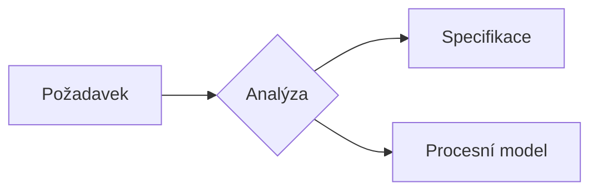

# Instrukce pro práci s diagramy

Tento dokument obsahuje instrukce pro vytváření a správu diagramů v projektu.

## Typy diagramů

V projektu se používají následující typy diagramů:

- **PlantUML** (`.puml`) - pro technické schémata infrastruktury
- **Mermaid** (`.mmd`) - pro diagramy inline v Markdownu i export do PNG
- **draw.io** (`.drawio`) - pro architektonické diagramy a schémata
- **PNG obrázky** (`.png`) - exportované diagramy pro vložení do MD dokumentů
- **Archi formáty** (`.archimate`, `.xmi`, `.csv`, `.xml`) - pro ArchiMate modelování v Archi nástroji

## Umístění diagramů

Všechny diagramy jsou uloženy ve složce `output/diagrams/`.

## PlantUML diagramy

### Vytváření PlantUML diagramů

- Zdrojové soubory: `output/diagrams/*.puml`
- Export do PNG: použij lokální PlantUML (`d:\Applications\PlantUML\plantuml.jar`) nebo Java (`C:\Program Files\Eclipse Adoptium\jdk-17.0.17.10-hotspot\bin\java.exe`)

### Generování PNG z PlantUML

```powershell
cd output\diagrams
& "C:\Program Files\Eclipse Adoptium\jdk-17.0.17.10-hotspot\bin\java.exe" -jar "d:\Applications\PlantUML\plantuml.jar" -tpng "nazev-diagramu.puml"
```

### Barevné vs. černobílé verze

- **Barevné verze**: použij barevné skinparam nastavení v PlantUML souboru
- **Černobílé verze**: použij výchozí PlantUML nastavení nebo explicitně nastav `skinparam monochrome true`

### Konvence pojmenování PlantUML souborů

- Technické schémata: `navrh-infrastruktury.puml`, `navrh-infrastruktury-color.puml`
- Architektonické diagramy: `archimate-stavajici.puml`, `archimate-navrh.puml`

## Mermaid diagramy

### Kdy použít Mermaid vs PlantUML

- **Mermaid** – inline diagramy přímo v Markdown dokumentech (renderuje GitHub, GitLab, Cursor preview), rychlé skici, Gantt charty, ER diagramy, flowcharty
- **PlantUML** – složitější technické diagramy, detailní infrastrukturní schémata, rozsáhlé class/deployment diagramy s pokročilým formátováním

### Podporované typy diagramů

- Flowchart, Sequence Diagram, Class Diagram, State Diagram
- Entity-Relationship Diagram (ER), Data Flow
- Gantt Chart, Timeline
- Pie Chart, Mindmap

### Inline v Markdownu

Mermaid diagramy lze vložit přímo do `.md` dokumentů bez externího souboru:

````markdown

````

### Samostatné zdrojové soubory

- Zdrojové soubory: `output/diagrams/*.mmd`
- Pro složitější nebo znovupoužitelné diagramy

### Generování obrázků z Mermaid CLI

Export do SVG (preferovaný formát – používá konfiguraci):

```powershell
& "C:\Users\Richard\AppData\Roaming\npm\mmdc.cmd" -c "c:\Users\Richard\mermaid-config\config.json" -i "output\diagrams\nazev-diagramu.mmd" -o "output\diagrams\nazev-diagramu.svg"
```

Export do PNG:

```powershell
& "C:\Users\Richard\AppData\Roaming\npm\mmdc.cmd" -c "c:\Users\Richard\mermaid-config\config.json" -i "output\diagrams\nazev-diagramu.mmd" -o "output\diagrams\nazev-diagramu.png"
```

### Konvence pojmenování Mermaid souborů

- Procesní diagramy: `proces-registrace.mmd`, `flow-objednavka.mmd`
- Sekvenční diagramy: `seq-autentizace.mmd`, `seq-platba.mmd`
- ER diagramy: `er-uzivatele.mmd`, `er-objednavky.mmd`
- Stavové diagramy: `state-dokument.mmd`, `state-objednavka.mmd`
- Gantt charty: `gantt-faze1.mmd`, `gantt-sprint.mmd`

---

## draw.io diagramy

### Vytváření draw.io diagramů

- Zdrojové soubory: `output/diagrams/*.drawio`
- Otevření: použij lokální draw.io (`c:\Program Files\draw.io\draw.io.exe`)
- Export do PNG: File → Export as → PNG

### Generování PNG z draw.io (příkazová řádka)

```powershell
& "c:\Program Files\draw.io\draw.io.exe" --export --format png --output "output\diagrams\nazev-diagramu.png" "output\diagrams\nazev-diagramu.drawio"
```

### Konvence pojmenování draw.io souborů

- Architektonické diagramy: `archimate-stavajici.drawio`, `archimate-navrh.drawio`
- Strukturované popisy: `drawio-popis-infrastruktury.md` (textový popis pro ruční vytvoření)

## Vložení diagramů do MD dokumentů

### Cesty k obrázkům

- Všechny PNG obrázky jsou ve složce `output/diagrams/`
- V MD dokumentech používej relativní cesty: `output/diagrams/nazev-diagramu.png`

### Syntaxe v Markdown

```markdown


*Obrázek X: Popis diagramu*
```

### Aktualizace diagramů

- Při změně diagramu aktualizuj příslušný `.puml`, `.mmd` nebo `.drawio` soubor
- Regeneruj PNG obrázek z aktualizovaného zdrojového souboru
- Aktualizuj hlavičku MD dokumentu (verze, revisions) pokud je diagram součástí dokumentu

## Verzování diagramů

- Diagramy jsou součástí projektu a měly by být verzovány v Git
- Při významných změnách diagramu vytvoř novou verzi (např. `navrh-infrastruktury-v2.puml`) nebo aktualizuj existující
- V MD dokumentech odkazuj na konkrétní verzi diagramu

## Nástroje pro práci s diagramy

Lokální cesty k nástrojům (viz `instructions/tools.md`):

- **Java**: `C:\Program Files\Eclipse Adoptium\jdk-17.0.17.10-hotspot\bin\java.exe`
- **PlantUML**: `d:\Applications\PlantUML\plantuml.jar`
- **Mermaid CLI**: `C:\Users\Richard\AppData\Roaming\npm\mmdc.cmd`
- **draw.io**: `c:\Program Files\draw.io\draw.io.exe`
- **Archi**: `c:\Program Files\Archi\Archi.exe`

## Archi formáty (ArchiMate modeling)

### Archi nástroj

Archi je open-source nástroj pro modelování ArchiMate diagramů. Podporuje následující formáty:

- **`.archimate`** - nativní formát Archi (XML-based, proprietární struktura Archi)
- **`.xmi`** (XML Metadata Interchange) - standardní formát pro výměnu ArchiMate modelů mezi nástroji (např. Archi ↔ BiZZdesign Enterprise Studio, Sparx Enterprise Architect)
- **`.csv`** - export tabulek komponent (Business Actors, Application Components, Technology Nodes, Technology Devices, System Software, atd.) s jejich vlastnostmi
- **`.xml`** - export modelu v XML formátu (alternativní formát pro programové zpracování)

### Vytváření Archi diagramů

1. Otevři Archi nástroj
2. Vytvoř nový model nebo otevři existující `.archimate` soubor
3. Modeluj komponenty podle ArchiMate 3.2 specifikace:
   - **Business Layer**: Business Actors, Business Services, Business Objects
   - **Application Layer**: Application Components, Application Services, Application Interfaces
   - **Technology Layer**: Technology Nodes, Technology Devices, System Software, Technology Services
   - **Relationships**: Assignment, Realization, Serving, Access, atd.

### Export z Archi

**Export do XMI (XML Metadata Interchange):**
- File → Export Model → XMI
- Ulož jako `output/diagrams/nazev-modelu.xmi`
- **Použití**: Výměna modelů mezi Archi a jinými ArchiMate nástroji, zálohování modelů ve standardním formátu
- **Formát**: XML podle OMG XMI specifikace pro ArchiMate

**Export do CSV (Comma-Separated Values):**
- File → Export Model → CSV
- Ulož jako `output/diagrams/nazev-modelu.csv`
- **Obsah**: Tabulka všech komponent s jejich vlastnostmi:
  - ID komponenty
  - Název komponenty
  - Typ komponenty (Business Actor, Application Component, Technology Node, atd.)
  - Dokumentace
  - Vlastnosti (properties)
  - Vztahy (relationships)
- **Použití**: Analýza komponent v tabulkovém procesoru (Excel, LibreOffice Calc), generování reportů, kontrola konzistence

**Export do XML:**
- File → Export Model → XML
- Ulož jako `output/diagrams/nazev-modelu.xml`
- **Použití**: Programové zpracování modelů, transformace pomocí XSLT, integrace s jinými nástroji
- **Formát**: XML struktura reprezentující ArchiMate model

**Export do PNG/JPEG/SVG:**
- File → Export → Image → PNG/JPEG/SVG
- Ulož jako `output/diagrams/nazev-modelu.png`
- **Použití**: Vložení diagramu do dokumentace, prezentací

### Import do Archi

- **XMI**: File → Import Model → XMI (pro import z jiných ArchiMate nástrojů)
  - Podporuje import modelů vytvořených v jiných ArchiMate nástrojích
  - Užitečné pro migraci mezi nástroji nebo konsolidaci modelů
- **XML**: File → Import Model → XML
  - Pro import vlastních XML struktur nebo transformovaných modelů

### Konvence pojmenování Archi souborů

- **ArchiMate modely**: `archimate-stavajici.archimate`, `archimate-navrh.archimate`
- **XMI exporty**: `archimate-stavajici.xmi`, `archimate-navrh.xmi`
- **CSV exporty**: `archimate-stavajici.csv`, `archimate-navrh.csv`
- **XML exporty**: `archimate-stavajici.xml`, `archimate-navrh.xml`
- **PNG exporty**: `archimate-stavajici.png`, `archimate-navrh.png`

### Použití Archi formátů

- **`.archimate`**: 
  - Primární formát pro práci v Archi nástroji
  - Ukládá kompletní model včetně všech vlastností, vztahů a vizualizací
  - Verzovat v Git pro historii změn

- **XMI**: 
  - Pro výměnu modelů mezi Archi a jinými ArchiMate nástroji (BiZZdesign, Sparx EA, atd.)
  - Pro zálohování modelů ve standardním formátu
  - Pro migraci mezi různými ArchiMate nástroji

- **CSV**: 
  - Pro analýzu komponent v tabulkovém procesoru
  - Pro generování reportů a kontrolních seznamů
  - Pro audit komponent a jejich vlastností
  - Pro import/export dat do jiných systémů (CMDB, dokumentace)

- **XML**: 
  - Pro programové zpracování modelů
  - Pro transformace pomocí XSLT
  - Pro integraci s jinými nástroji přes API
  - Pro automatizované generování dokumentace

### Best practices pro Archi formáty

1. **Pravidelné exporty**: Exportuj modely do XMI/CSV/XML při významných změnách
2. **Verzování**: Ukládej všechny formáty (`.archimate`, `.xmi`, `.csv`, `.xml`) do Git pro historii
3. **Zálohování**: XMI formát je vhodný pro zálohování kvůli standardnímu formátu
4. **Dokumentace**: CSV exporty používej pro generování tabulek komponent v dokumentaci
5. **Integrace**: XML formáty používej pro automatizované zpracování a integraci s jinými nástroji

## Best practices

1. **Zachovávej zdrojové soubory**: Vždy měj `.puml`, `.mmd`, `.drawio` nebo `.archimate` soubor, nejen PNG
2. **Barevné vs. černobílé**: Vytvářej obě verze pokud je potřeba (např. pro tisk vs. prezentaci)
3. **Konzistentní pojmenování**: Používej konzistentní konvence pojmenování napříč projektem
4. **Aktualizace dokumentace**: Při změně diagramu aktualizuj i příslušnou dokumentaci
5. **Verzování**: Při významných změnách vytvoř novou verzi diagramu
6. **Archi exporty**: Pravidelně exportuj Archi modely do XMI/CSV/XML pro zálohování a výměnu s jinými nástroji
