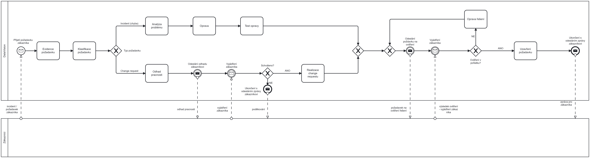

# Proces 3 — Řešení požadavku (incident / change)

**BPMN 2.0 — collaboration:** interní proces organizace **DataVision** (dodavatel) a externí **Zákazníci** (black-box pool). Model je v **Camunda Modeler** určen pro **Camunda Cloud 8.x** (`isExecutable="true"` u procesu DataVision).

---

## Účel procesu

Řídit **životní cyklus požadavku zákazníka** od přijetí přes **klasifikaci** a větev **incidentu** nebo **change requestu**, přes **schválení rozsahu** (u change), **realizaci** a **ověření u zákazníka** až po **uzavření** a finální komunikaci. Odpovídá logice ITSM (ticket, klasifikace, incident vs. změna, uzavření).

---

## Účastníci

| Pool | Role |
|------|------|
| **DataVision** | Evidence, klasifikace, řešení, komunikace se zákazníkem (sequence flow). |
| **Zákazníci** | Externí strana; interakce pouze přes **message flow** (přerušované čáry). |

---

## Hlavní tok

1. **Start (message): Přijetí požadavku zákazníka** — zahájení zprávou od zákazníka (*incident / požadavek zákazníka*).
2. **Evidence požadavku** — záznam do systému (ticket).
3. **Klasifikace požadavku** — zařazení typu práce.
4. **Exkluzivní brána „Typ požadavku“** (vzájemně se vylučující varianty — vhodná je **XOR**, nikoli inkluzivní brána):
   - **Incident (chyba):** Analýza problému → Oprava → Test opravy → návaznost na společný **join** s druhou větví.
   - **Change request:** Odhad pracnosti → **Odeslání odhadu zákazníkovi** (throw message) → **Vyjádření zákazníka** (catch) k odhadu → **Schváleno?**
     - **NE** → **Ukončení s odesláním zprávy zákazníkovi** (message end, např. poděkování).
     - **ANO** → **Realizace change requestu** → **join** s incident větví.

5. Po sloučení obou větví (**exkluzivní join**): společná fáze ověření u zákazníka.

6. **Exkluzivní join** před odesláním na ověření (**Gateway**): slučuje **první průchod** po dokončení řešení a **návrat** z úkolu **Oprava řešení** (smyčka při nevyhovujícím ověření). Odtud jeden tok vstupuje do **intermediate throw** „odeslání požadavku na ověření“ — správná BPMN notace (jeden vstup do throw).

7. **Intermediate catch** — vyjádření zákazníka k ověření (*výsledek ověření / vyjádření*).

8. **Exkluzivní brána „Ověření v pořádku?“**
   - **NE** → **Oprava řešení** → zpět na join před krokem 6 (opakované ověření).
   - **ANO** → **Uzavření požadavku** → **Ukončení s odesláním zprávy zákazníkovi** (message end).

---

## Komunikace se zákazníkem (message flows)

| Směr | Název na diagramu | Význam |
|------|-------------------|--------|
| Zákazník → DataVision | incident / požadavek zákazníka | Spuštění procesu. |
| DataVision → Zákazník | odhad pracnosti | Odeslání odhadu (change větev). |
| Zákazník → DataVision | vyjádření zákazníka | Odpověď k odhadu. |
| DataVision → Zákazník | poděkování | Po zamítnutí change (NE u Schváleno?). |
| DataVision → Zákazník | požadavek na ověření řešení | Žádost o potvrzení vyřešení. |
| Zákazník → DataVision | výsledek ověření - vyjádření zákazníka | Zpětná vazba k ověření. |
| DataVision → Zákazník | zpráva pro zákazníka | Finální zpráva při uzavření. |

---

## Poznámky k modelu

- Dva **catch** s popiskem „Vyjádření zákazníka“ se liší kontextem: **k odhadu** (change) vs **k ověření řešení** — při implementaci rozlište **zprávy** nebo korelaci.
- **Exkluzivní brány** odpovídají výběru jedné z variant (typ požadavku, schválení, výsledek ověření); u tohoto procesu **inkluzivní brána** pro tyto rozcestí typicky **není potřeba** (na rozdíl od Procesu 2 s volitelnými částmi návrhu podle rozsahu).

---

## Implementace (Camunda 8)

- Doplnit **definice zpráv** ke všem message start / throw / catch / end událostem a **korelaci** s ID požadavku.
- Úlohy lze mapovat na **job workers** nebo **user tasks** podle reality (evidence může být automatizovaná službou).

---

*Zdroj modelu: `input/Diagrams/Úkol 4_Proces 3-Řešení požadavku.bpmn` (Camunda Modeler).*
