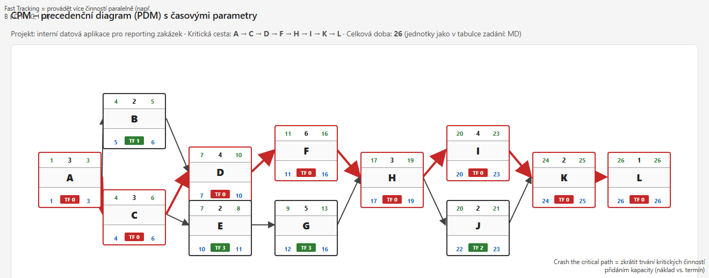

# Úkol 2 – Metoda kritické cesty (CPM)

**Projekt:** Vývoj interní datové aplikace pro reporting zakázek (DataVision s.r.o.)  
**Jednotka:** MD (mandays)  
**Cíle úkolu:** určit **kritickou cestu**, **časové rezervy** aktivit a **celkovou dobu trvání** projektu.

### Formát PDM diagramu (precedenční síť s časy)

Každá činnost je uzel ve tvaru mřížky:

| Oblast | Obsah | Barva |
|--------|--------|--------|
| Horní řádek vlevo / vpravo | **ES**, **EF** (nejčasnější začátek a konec) | zeleně |
| Horní střed | **trvání** | černě |
| Střed | značka činnosti (**A**–**L**) | tučně |
| Dolní řádek vlevo / vpravo | **LS**, **LF** (nej pozdější začátek a konec) | modře |
| Dolní střed (pruh) | **Total Float (TF)** – u kritických činností **0** (červený pruh), u ostatních hodnota rezervy (zelený pruh) | červeně / zeleně |

Čísla **ES/EF/LS/LF** v diagramu jsou v **škále od 1** (první jednotka projektu = 1). Přepočet od tabulky v této kapitole (kde ES/LS často začínají od 0): **ES a LS v diagramu = hodnota z tabulky + 1**; **EF a LF** v diagramu odpovídají koncovým okrajům aktivit ve stejné škále (podrobně v `CPM_kriticka_cesta_grid.html`).

**Šipky:** červeně = kritická cesta, černě = ostatní návaznosti. **Mermaid** tento typ uzlu s vnitřní mřížkou **nepokrývá**; slouží zjednodušený diagram (jen uzly a barvy hran).

**Soubory:**

- `output/diagrams/CPM_kriticka_cesta_grid.html` — **hlavní PDM diagram** (stejný obsah jako náhled PNG)
- `output/diagrams/CPM_kriticka_cesta_grid.png` — export náhledu (Playwright)
- `output/diagrams/CPM_kriticka_cesta.html` / `.svg` — zjednodušená síť bez mřížky v uzlech
- `output/diagrams/CPM_kriticka_cesta.mmd` — Mermaid (zjednodušeně)
- `output/diagrams/CPM_kriticka_cesta_mermaid.png` — PNG z Mermaid CLI

**Opětovný export PNG (zjednodušený Mermaid):**

```bash
npx -y @mermaid-js/mermaid-cli@latest -i CPM_kriticka_cesta.mmd -o CPM_kriticka_cesta_mermaid.png -b white -w 1400
```

**Opětovný export PNG (PDM mřížka):**

```bash
npx -y playwright@latest screenshot "file:///d:/Cursor/BPMN_training/output/diagrams/CPM_kriticka_cesta_grid.html" CPM_kriticka_cesta_grid.png --viewport-size=1320,520
```
*(Upravte cestu k HTML podle umístění projektu.)*



---

## 1. Tabulka činností (zadání)

| Činnost | Název | Trvání (MD) | Bezprostřední předchůdci |
|---------|--------|-------------|---------------------------|
| A | Analýza požadavků klienta | 3 | — |
| B | Návrh architektury řešení | 2 | A |
| C | Návrh datového modelu | 3 | A |
| D | Návrh API a backend logiky | 4 | B, C |
| E | Návrh UI/UX aplikace | 2 | C |
| F | Vývoj backendu | 6 | D |
| G | Vývoj frontendu | 5 | E |
| H | Integrace frontend + backend | 3 | F, G |
| I | Testování aplikace | 4 | H |
| J | Příprava deploymentu (Docker) | 2 | H |
| K | Nasazení u klienta | 2 | I, J |
| L | Předání a školení uživatelů | 1 | K |

*Poznámka zadání:* backend a frontend běží paralelně; integrace až po obou; projekt končí až po školení.

---

## 2. Časové rezervy – výpočet (ES, EF, LS, LF, rezerva)

**Legenda:**  
- **ES** = nejčasnější začátek (Early Start), **EF** = nejčasnější konec (Early Finish)  
- **LF** = nejpozdější konec (Late Finish), **LS** = nejpozdější začátek (Late Start)  
- **Rezerva (slack)** = LS − ES = LF − EF (pro konzistentní síť musí platit stejně)

### 2.1 Dopředný průchod (od začátku)

| Akt. | Trv. | ES | EF | Pravidlo |
|------|------|----|----|----------|
| A | 3 | 0 | 3 | start |
| B | 2 | 3 | 5 | po A |
| C | 3 | 3 | 6 | po A |
| D | 4 | **6** | **10** | max(EF_B, EF_C) = max(5,6) |
| E | 2 | 6 | 8 | po C |
| F | 6 | 10 | 16 | po D |
| G | 5 | 8 | 13 | po E |
| H | 3 | **16** | **19** | max(EF_F, EF_G) = max(16,13) |
| I | 4 | 19 | 23 | po H |
| J | 2 | 19 | 21 | po H |
| K | 2 | **23** | **25** | max(EF_I, EF_J) = max(23,21) |
| L | 1 | 25 | **26** | po K |

### 2.2 Zpětný průchod (konec projektu EF = 26)

| Akt. | Trv. | LF | LS | Pravidlo |
|------|------|----|----|----------|
| L | 1 | 26 | 25 | LF = projekt |
| K | 2 | 25 | 23 | před L |
| I | 4 | 23 | 19 | před K |
| J | 2 | 23 | 21 | před K |
| H | 3 | 19 | 16 | min(LS_I, LS_J) = min(19,21) |
| F | 6 | 16 | 10 | před H |
| G | 5 | 16 | 11 | před H |
| D | 4 | 10 | 6 | před F |
| E | 2 | 11 | 9 | před G |
| C | 3 | 6 | 3 | min(LS_D, LS_E) = min(6,9) |
| B | 2 | 6 | 4 | před D |
| A | 3 | 3 | 0 | min(LS_B, LS_C) = min(4,3) |

### 2.3 Rezerva (slack) podle aktivity

| Akt. | ES | LS | **Rezerva (MD)** |
|------|----|----|------------------|
| A | 0 | 0 | **0** |
| B | 3 | 4 | **1** |
| C | 3 | 3 | **0** |
| D | 6 | 6 | **0** |
| E | 6 | 9 | **3** |
| F | 10 | 10 | **0** |
| G | 8 | 11 | **3** |
| H | 16 | 16 | **0** |
| I | 19 | 19 | **0** |
| J | 19 | 21 | **2** |
| K | 23 | 23 | **0** |
| L | 25 | 25 | **0** |

---

## 3. Kritická cesta a celková doba

**Celková doba projektu (kritický čas dokončení):** **26 MD** (od dokončení A do dokončení L; počátek v čase 0).

**Kritická cesta** (aktivity s rezervou **0**):

**A → C → D → F → H → I → K → L**

*(Větev přes B není kritická – B má rezervu 1 MD. Větev C → E → G není kritická – E a G mají rezervu 3 MD; G končí v čase 13, zatímco F v 16, takže integrace H čeká na F.)*

**Aktivity mimo kritickou cestu (nulový vliv na termín projektu při čerpání rezervy):**

- **B** – rezerva 1 MD  
- **E**, **G** – rezerva 3 MD každá (řetězec návrhu UI a frontendu může „klouzat“, dokud G skončí nejpozději tak, aby F stále určoval start H)  
- **J** – rezerva 2 MD (příprava Dockeru může být dokončena až do konce času 21, zatímco kritické testování I končí v 23)

---

## 4. Krátká interpretace pro školení

- **Kritická cesta** určuje minimální délku projektu při daných návaznostech; zpoždění kterékoli aktivity **A, C, D, F, H, I, K, L** prodlouží celý projekt o stejnou dobu.  
- **Rezerva** u B, E, G, J umožňuje přesuny v rámci uvedených MD bez vlivu na termín dokončení L – při řízení rizik je vhodné rezervy u nejkritičtějších paralelních větví sledovat (např. J vs. I před K).

---

*Souvislost s případovou studií: interní aplikace, Docker u klienta – struktura aktivit odpovídá paralelnímu vývoji a sloučení před nasazením.*
