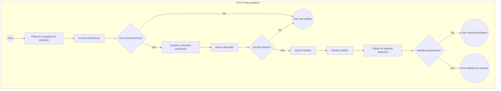
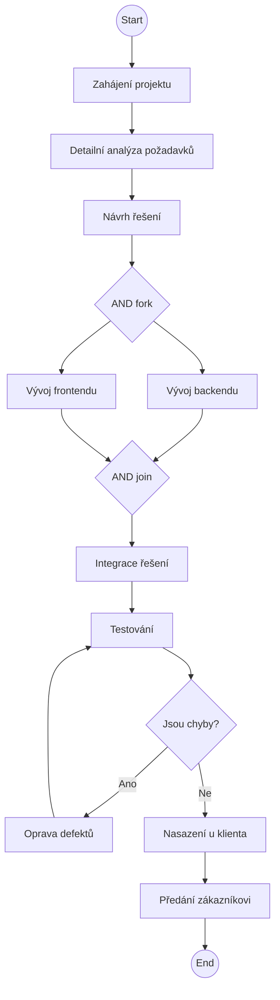
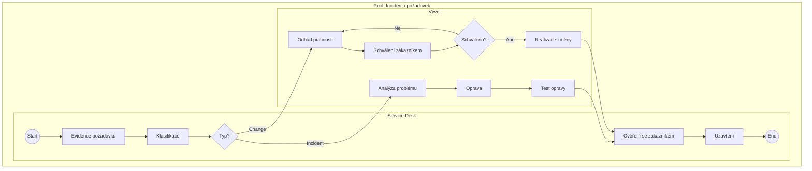
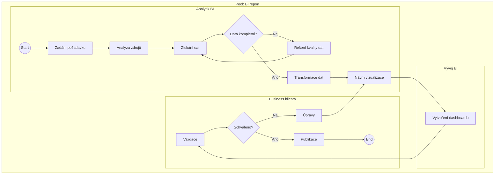

# BPMN 2.0 – návrh procesů (praktický úkol 4)

**Firma:** DataVision s.r.o.  
**Účel:** návrh **čtyř procesů** ve standardu **BPMN 2.0** podle případové studie.  
**Výstupy:** tento dokument (popis poolů, lanes, událostí, úloh, brán a toků) + diagramy v Mermaid (náhled); pro **formální BPMN 2.0 XML** lze stejnou strukturu přenést do **Camunda Modeler** / **Draw.io** (BPMN šablona).

**Publikovaný detail — Proces 1 (Sales):** [diagram z Camundy + textový popis BPMN](/reseni/ukol-4/proces-1-sales).

**Publikovaný detail — Proces 2 (Realizace IT):** [diagram z Camundy + textový popis BPMN](/reseni/ukol-4/proces-2-realizace).

---

## Požadavky ze zadání (kontrolní seznam)

| Požadavek | Jak je splněn v návrhu |
|-------------|-------------------------|
| **Role (swimlanes)** | U každého procesu je **pool** a uvnitř **lanes** (pásy); úlohy jsou přiřazeny rolím. |
| **Události (start / end)** | Každý proces má **Start Event** a jeden nebo více **End Event** (příp. rozlišené výsledky). |
| **Činnosti (tasks)** | Aktivity modelované jako **Task** (uživatelské / obecné); kde dává smysl rozlišení typu, je uvedeno v textu. |
| **Rozhodování (gateway)** | Použity **exkluzivní brány (XOR)** pro větvení; u paralelního vývoje **paralelní brány (AND)**. |
| **Správné vazby (sequence flow)** | Popis toků níže a znázornění v diagramu; bez „visících“ uzlů. |

**Konvence názvů:** české popisy; ID prvků v tabulkách pro přenos do modeleru.

---

## Proces 1 – Získání a zpracování poptávky (Sales)

### Účel
Zpracovat příchozí poptávku od **prvního kontaktu** až po **rozhodnutí zákazníka** o nabídce (včetně zamítnutí).

### Pool a lanes

| Pool | Lane | Role / odpovědnost |
|------|------|---------------------|
| **P1 – Prodej poptávky** | **Obchod** | Příjem poptávky, screening, komunikace se zákazníkem, nabídka, odeslání. |
| | **Analytik** | Interní odhad pracnosti (MD), odborný vstup do nabídky. |

*Poznámka:* Zákazník není samostatný pool; rozhodnutí „akceptace / zamítnutí“ je modelováno jako **čekání na odpověď** a **XOR** podle výsledku (typické pro interní proces dodavatele).

### Prvky BPMN (logická posloupnost)

| ID | Typ BPMN | Název |
|----|-----------|--------|
| P1-SE1 | Start Event (Message / obecné) | Poptávka přijata (e-mail / web / doporučení) |
| P1-T1 | Task | Přijmout a zaregistrovat poptávku |
| P1-T2 | Task | Prvotní vyhodnocení (smysl, relevance) |
| P1-G1 | Exclusive Gateway (XOR) | Má smysl pokračovat? |
| P1-T3 | Task | Kontaktovat zákazníka a upřesnit požadavky |
| P1-T4 | Task | Interní odhad pracnosti (MD) |
| P1-G2 | Exclusive Gateway (XOR) | Vytvořit nabídku? |
| P1-T5 | Task | Vytvořit nabídku |
| P1-T6 | Task | Odeslat nabídku zákazníkovi |
| P1-T7 | Task | Čekání na odpověď zákazníka (nebo receive task) |
| P1-G3 | Exclusive Gateway (XOR) | Akceptace nabídky? |
| P1-EE1 | End Event | Poptávka zamítnuta / bez nabídky |
| P1-EE2 | End Event | Nabídka odmítnuta zákazníkem |
| P1-EE3 | End Event | Nabídka akceptována – předání do realizace |

**Tok:** SE1 → T1 (Obchod) → T2 (Obchod) → G1 → *[Ne]* → EE1 | *[Ano]* → T3 (Obchod) → T4 (Analytik) → G2 → *[Ne]* → EE1 | *[Ano]* → T5 (Obchod; s využitím výstupu analytika) → T6 → T7 → G3 → *[Ne]* → EE2 | *[Ano]* → EE3.

### Diagram (Mermaid – logický tok; v Camundě rozdělit úlohy do lanes)

**Přiřazení k lane:** T1, T2, T3, T5, T6, T7 → **Obchod** · T4 → **Analytik** · brány G1–G3 umístěte na hranici pásů nebo u Obchod. **Sequence flow** v BPMN 2.0 mezi pásy je povolený.

---

## Proces 2 – Realizace IT projektu

### Účel
Realizace schválené zakázky: analýza, návrh, **paralelní vývoj** backend / frontend, integrace, testování s **cyklem oprav**, nasazení, předání.

### Pool a lanes

| Pool | Lane |
|------|------|
| **P2 – Realizace IT projektu** | **PM** – koordinace, zahájení, předání |
| | **Analytik** – detailní analýza, návrh |
| | **Vývoj backend** |
| | **Vývoj frontend** |
| | **QA** – testování |
| | **Nasazení** – deployment u klienta (např. Docker) |

### Prvky BPMN

| ID | Typ | Název |
|----|-----|--------|
| P2-SE1 | Start Event | Projekt zahájen (nabídka akceptována) |
| P2-T1 | Task | Zahájení projektu (kick-off) |
| P2-T2 | Task | Detailní analýza požadavků |
| P2-T3 | Task | Návrh řešení (architektura, data, UI) |
| P2-GAND1 | Parallel Gateway (fork) | Rozdělení na BE / FE |
| P2-T4 | Task | Vývoj backendu |
| P2-T5 | Task | Vývoj frontendu |
| P2-GAND2 | Parallel Gateway (join) | Sjednocení po vývoji |
| P2-T6 | Task | Integrace řešení |
| P2-T7 | Task | Testování |
| P2-G1 | Exclusive Gateway (XOR) | Nalezeny chyby? |
| P2-T8 | Task | Oprava defektů (vývoj) |
| P2-T9 | Task | Nasazení řešení |
| P2-T10 | Task | Předání zákazníkovi (školení, dokumentace) |
| P2-EE1 | End Event | Projekt ukončen |

**Tok:** SE1 → T1 (PM) → T2 → T3 → **AND fork** → T4 ∥ T5 → **AND join** → T6 → T7 (QA) → G1 → *[Ano]* → T8 → **zpět na T7** (cyklus) | *[Ne]* → T9 (Nasazení) → T10 (PM) → EE1.

*Cyklus oprav:* dokud G1 hlásí chyby, T8 opakuje opravu a návrat na test (odpovídá zadání „ANO → oprava → zpět na vývoj“ v jednoduchém modelu bez opětovného rozvětvení BE/FE v každé iteraci).

### Diagram (Mermaid – jeden pool; v modeleru rozdělit do lanes)

**Přiřazení k lane:** T1, T10 → **PM** · T2, T3 → **Analytik** · T4 → **Vývoj backend** · T5 → **Vývoj frontend** · T6, T7, T8 → **QA** (T8 případně sdílet s vývojovými pásy) · T9 → **Nasazení**.

---

## Proces 3 – Řešení incidentu / požadavku zákazníka

### Účel
Jednotný tok pro **incident** vs. **change request** s **sloučením** před uzavřením.

### Pool a lanes

| Pool | Lane |
|------|------|
| **P3 – Service / požadavky** | **Service Desk** – příjem, evidence, klasifikace, koordinace |
| | **Vývoj / Řešitel** – analýza, oprava, realizace změny |
| | **Zákazník (externí)** | Schválení u změny (volitelná lane; lze sloučit do Service jako „schválení s klientem“) |

Pro jednoduchost návrhu: **dva pásy** + schválení jako task ve **Service Desk**.

### Prvky BPMN

| ID | Typ | Název |
|----|-----|--------|
| P3-SE1 | Start Event | Požadavek přijat (ticket / e-mail) |
| P3-T1 | Task | Evidence požadavku |
| P3-T2 | Task | Klasifikace typu |
| P3-G1 | Exclusive Gateway (XOR) | Incident nebo change? |
| P3-T3 | Task | Analýza problému (incident) |
| P3-T4 | Task | Oprava |
| P3-T5 | Task | Test opravy |
| P3-T6 | Task | Odhad pracnosti (change) |
| P3-T7 | Task | Schválení zákazníkem |
| P3-T8 | Task | Realizace změny |
| P3-G2 | Exclusive Gateway (XOR) | Schváleno? (u změny) |
| P3-T9 | Task | Ověření se zákazníkem |
| P3-T10 | Task | Uzavření požadavku |
| P3-EE1 | End Event | Uzavřeno |

**Tok:** SE1 → T1 → T2 → G1 → *[Incident]* → T3 → T4 → T5 → T9 | *[Change]* → T6 → T7 → G2 → *[Ne]* → T6 (iterace) / *[Ano]* → T8 → T9 → T10 → EE1.

*Poznámka:* Větev **Test opravy** u incidentu splývá s **T9 Ověření** – lze sloučit T5 do T9 nebo nechat T5 → T9.

### Diagram (Mermaid)

---

## Proces 4 – Vytvoření reportu (BI)

### Účel
End-to-end tvorba **dashboardu / reportu** pro management klienta včetně **kvality dat** a **schválení**.

### Pool a lanes

| Pool | Lane |
|------|------|
| **P4 – BI report** | **Analytik BI** – zdroje dat, transformace, návrh |
| | **Vývoj BI** – dashboard, vizualizace (např. Power BI) |
| | **Business klienta** – validace (může být lane „Zákazník“) |

### Prvky BPMN

| ID | Typ | Název |
|----|-----|--------|
| P4-SE1 | Start Event | Požadavek na report |
| P4-T1 | Task | Zadání / převzetí požadavku |
| P4-T2 | Task | Analýza datových zdrojů |
| P4-T3 | Task | Získání dat |
| P4-G1 | Exclusive Gateway (XOR) | Data kompletní? |
| P4-T4 | Task | Řešení kvality dat |
| P4-T5 | Task | Transformace dat |
| P4-T6 | Task | Návrh vizualizace |
| P4-T7 | Task | Vytvoření dashboardu |
| P4-T8 | Task | Validace se zákazníkem |
| P4-G2 | Exclusive Gateway (XOR) | Schváleno? |
| P4-T9 | Task | Úpravy / iterace návrhu |
| P4-T10 | Task | Publikace reportu |
| P4-EE1 | End Event | Report v provozu |

**Tok:** SE1 → T1 → T2 → T3 → G1 → *[Ne]* → T4 → T3 (návrat) | *[Ano]* → T5 → T6 → T7 (Vývoj BI) → T8 → G2 → *[Ne]* → T9 → T6 (nebo T7) | *[Ano]* → T10 → EE1.

*Iterace „NE – úpravy“:* z G2 zpět typicky na **T6 Návrh vizualizace** nebo **T7 Dashboard** – v návrhu je **T9 Úpravy** → návrat na **T6**.

### Diagram (Mermaid)

---

## Doporučení pro odevzdání do školení

1. **Camunda Modeler** nebo **Draw.io** (záložka BPMN): překreslit každý proces podle tabulek ID výše – zajistíte validní **BPMN 2.0** a správné **sequence flow** mezi pásy.  
2. U **Procesu 1** dejte **gateway G2** vizuálně na hranici mezi **Obchod** a **Analytik** (nebo duplicitní logický tok z obou pásů).  
3. U **Procesu 2** ověřte **paralelní gateway** (symetrický fork/join) a **cyklus** Test → Oprava → Test.  
4. U **Procesu 3** doplňte do modeleru přesné **labely** na větvách XOR.  
5. U **Procesu 4** může být lane **Business klienta** zobrazen jako **black box pool** – podle požadavků lektora.

---

*Související výstupy projektu: `BMM_DataVision.md`, případová studie v `input/`.*
